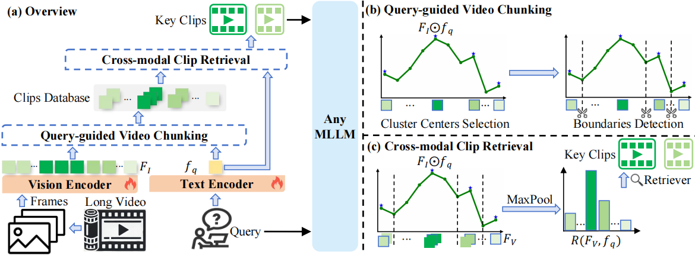

# Towards Effective and Efficient Long Video Understanding of Multimodal Large Language Models via One-shot Clip Retrieval 

## 👣Introduction

This repository implements OneClip-RAG, an effective and efficient method for long video understanding of Multimodal Large Language Models (MLLMs). OneClip-RAG directly applies cross-modal video chunking and clip retrieval in one single procedure centered on visual-language similarities.



### Key advantages:

- **Unified Cross-modal Video Chunking and Clip Retrieval:** We study the long video understanding problem of MLLMs from the perspective of video clip, and propose an effective and efficient method called OneClip-RAG.
- **Instruction Following Enhancement:** We build a new dataset called SynLongVideo with short-video mixups to improve the instruction following capability of OneClip, which is further supported by a coarse-to-fine training regime.
- **Outstanding Model Performance with Low Resource Requirement:** As a plug and play method, OneClip-RAG can greatly improve the performance of different MLLMs on long video understanding benchmarks, supporting the hour-long video inference on only one 4090 GPU.

## 🛠️ Usage

### OneClip

The training procedure for OneClip consists of two stages:

- **Stage I: Corase-grained Training Regime**
  - To make the visual-language embedding model firstly learn to align video-instruction positive pairs, this stage directly uses the clip frames of other videos as the negative examples.
- **Stage II: Graunlar Training Scheme**
  - To further enable the retriever grounding relevant clips within the long video according to the user's instruction, this stage only selects the hard negative examples from the other clips within the same long video.

#### 1. Install package

   ```
   cd OneClip
   conda env create -f environment.yml
   ```

#### 2. Corase-grained Training:

```
bash coarse_grained.sh 
```

#### 3. Graunlar Training:

```
bash fine_grained.sh 
```


### OneClip-RAG

Our OneClip-RAG is built upon LLaVA-NeXT.

#### 1. Set up and clone the LLaVA-NeXT environment using conda:

```
git clone https://github.com/LLaVA-VL/LLaVA-NeXT
cd LLaVA-NeXT
conda create -n llava python=3.10 -y
conda activate llava
pip install --upgrade pip  # Enable PEP 660 support.
pip install -e ".[train]"
```

#### 2. Copy all contents from the `OneClip-RAG` directory into LLaVA-NeXT's root directory;

#### 3. You can run the following command for inference:

```
python onecliprag_inference.py
```

## ⚡Evaluation

We follow the evaluation protocol of [LLaVA-v1.5](https://github.com/haotian-liu/LLaVA/tree/main) and conduct experiments on LongVideoBench, VideoMME, MLVU, QaEgo4D and TVQA-Long. All evaluation scripts are available in the `scripts/eval` directory. For detailed instructions, please refer to [LLaVA's Evaluation.md](https://github.com/haotian-liu/LLaVA/blob/main/docs/Evaluation.md). You can easily run the following script to evaluate five tasks:

```
# LongVideoBench
bash scripts/eval/longvideobench_eval.sh
# MLVU
bash scripts/eval/mlvu_eval.sh
# QaEgo4D 
bash scripts/eval/qaego4d_eval.sh
# TVQA-Long
bash scripts/eval/tvqalong_eval.sh
# Video-MME
bash scripts/eval/videomme_eval.sh
```